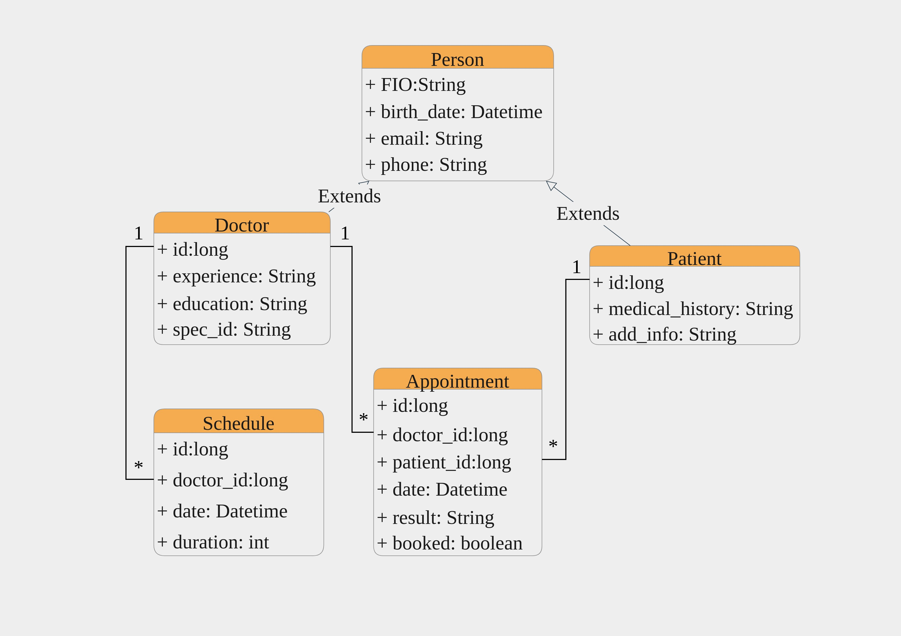

# Project Dentistry

This is a dentistry project. Backend and frontend parts are presented. The backend is made using InterSystems with ObjectScript, and the frontend is based on React.


## Description
The user can register in the system, keep track of their appointments with the dentist, and make appointments for new appointments. If the user is already registered in the system, then he can simply log in using his email login. He can view all working dentists, their qualifications, positions, work experience. For contacting dentists, their mobile phone and email numbers are listed, as well as viewing the schedule of an individual dentist

## Class diagram



## How to Test it
```
$ docker-compose exec iris iris session iris
USER> zn "IRISAPP"
IRISAPP> write ##class(Dentistry.Doctor).Populate()
```

